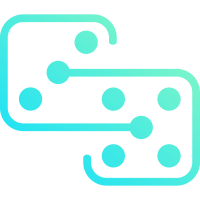

  

# Race Protocol   

Race Protocol is a multi-chain infrastructure for asymmetric competitive games.

Race Protocol is made for web3 builders, because it eliminates the barrier of developing blockchain games.

It is shipped with game-related smart contracts. Out of the box, these contracts provide developers with reliable and convenient utilities such as real time, transparent token settlements, programmable game management, affiliation and referral system.

The community hosted servers offer developers a delightful serverless solution, so that they can focus on the core game logic, without wrestling against various server-side difficulties. Thus, the development experience is considerably improved.

It offers excellent extensibility by decoupling game core and frontend. On the one hand, the game logic is published as NFTs and can be reused effortlessly. On the other hand, frontends can be built as either traditional dApps or metaverse applications, enabling the developers to connect players from different platforms.

Race Protocol is also designed for web3 players, because it assures them a fair and safe gaming experience.

All games built on top of Race will by default inherit a series of essential traits, such as P2P randomization and encrypted communication. This design guarantees hidden knowledge in asymmetric competition is well protected. No one can rig the game by knowing all the game information.

Users' assets are secured as the funds flow is controlled exclusively by the smart contracts. Since the funds will never be sent  to a centralised service, every penny of commission and deposit is 100% transparent to the public.

"Race" represents "Redefining the best".

# Project Status

Work in progress, not ready to accept contributions yet.

# Packages

## TypeScript

| Package                     | Version                                                                                                                              | Description                                    |
|-----------------------------|--------------------------------------------------------------------------------------------------------------------------------------|------------------------------------------------|
| @race-foundation/borsh      |          | A borsh implementation with decorators support |
| @race-foundation/sdk-core   |    | SDK for RACE Protocol                          |
| @race-foundation/sdk-solana |  | SDK integration for Solana blockchain          |
| @race-foundation/sdk-facade |  | SDK integration for local facade server        |

## Rust

| Package         | Version                                                                                                             | Description         |
|-----------------|---------------------------------------------------------------------------------------------------------------------|---------------------|
| race-api        |                | API for game bundle |
| race-core       |              | Core lib            |
| race-proc-macro |  | SDK proc macros     |
| race-encryptor  |    | Encryptor module    |
| race-client     |          | Client module       |
| race-test       |              | Testkit             |

### Binary Releases

- `race-facade`: The test server used in development
- `race-transactor`: The transactor server
- `race-cli`: The tools to manage on-chain accounts

## Contracts

| Blockchain | Address                                                                                                                 |
|------------|-------------------------------------------------------------------------------------------------------------------------|
| Solana     | [8ZVzTrut4TMXjRod2QRFBqGeyLzfLNnQEj2jw3q1sBqu](https://solscan.io/account/8ZVzTrut4TMXjRod2QRFBqGeyLzfLNnQEj2jw3q1sBqu) |

# Core Concepts

[Terminology](docs/terminology.md)

[WebAssembly Usages](docs/web-assembly-usages.md)

[Game Handler](docs/game-handler.md)

[Transactions](docs/transactions.md)

[Randomization](docs/randomization.md)

[Transactor and Validator](docs/transactor-and-validator.md)

[On-chain Accounts](docs/on-chain-accounts.md)

[Synchronization](docs/synchronization.md)

[Contract](docs/contract.md)

[Payment](docs/payment.md)

[Testing](docs/testing.md)

[Command Line Tools](docs/command-line.md)

# License

Race is licensed under [MPL-2.0](./LICENSE).
