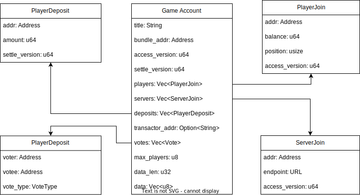

# On-chain Accounts

Race doesn't use any centralized database, all data will be persisted
on chain, including game accounts, game bundles, registartions, and
player profiles.  By eliminating the database usages as much as
possible, the whole system is extremely simplified and
transparentized.

## Game Account

Game account, represents a game, or a game room.  Game account is the
most complex account in the system, it's frequently updated by both
players and servers.

### Bundle Addr and Game Data

Each game account is bound to one type of game, specified by
`bundle_addr`, which is unchangable.  Each game has its own definition
for the format of properties.  For example, in a Texas Hold'em poker
game, it could be: small blind, big blind, etc.  Properties will be
serialized and stored as `data`.

### Players and Servers

Players and servers and join the game by writing themselves into the
account. The `access_version` will indicates the order of their joins.
Their assets will be stored in a staking account, which is independent
by games.

Check [Synchronization](sychronization.md) for more information about player handling.

### Votes

Because the game is served by multiple servers, in the case of
Transactor server is down, other nodes will vote.  Only participants
of the game can vote. When there's enough vote for the game, the game
will be halted and assets will be frozen.  Thus intervention is
required to handle the exception.

## Game Bundle

Game bundle account, holds the wasm bundle, the compiled game core.

Storing WASM bundle on a traditional blockchain is not a good idea, it
could be very expensive.  So we use decentralized storage here, like
IPFS and Arweave.

However if we want to build any features for the "game owner", we need
the connection between the game account and its owner.  Here, NFT
would be a good fit.  So by publishing the game bundle, WASM bundle
will be uploaded to IPFS/Arweave, and a NFT that refers to the bundle
will be created.

## Player Profile

An account holds player information, including the nick name, avatar
NFT address, and social media information.  Each wallet can have only
one profile, and there's no password system.

## Registration

An account holds a list of games.  It's usually used to serve a game
hall, a website.

The registration could either be public or private, which means
whether it's permissionless for everyone to create their own games in
it.  However, since the registration is where servers discover new
games.  The website owner has to provide their registration to public,
so that servers can find all the game accounts, and load them.
