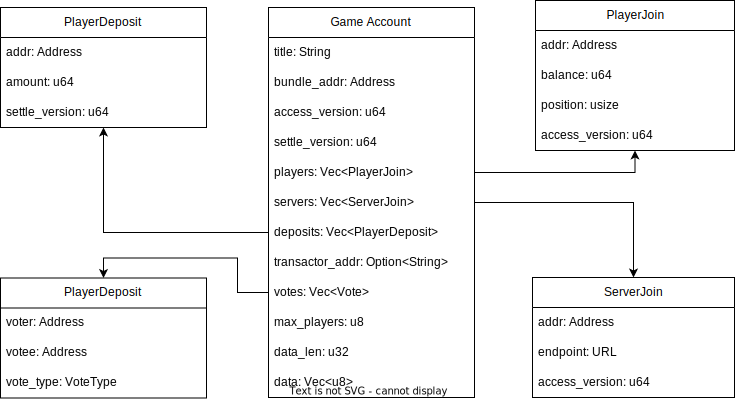

# On-chain Accounts

Race doesn't use any centralized database. Instead, all data is on chain, such
as game accounts, game bundles, registrations, and player profiles.  By
eliminating the database usages as much as possible, the whole system becomes
considerably simple and transparent.

## Game Account

A Game account represents a game or a game room.  It is the most complex account
in Race Protocol and will be frequently updated by both players and servers.

### Bundle Address and Game Data

Each game account is bound to one type of game, specified in `bundle_addr`,
which is immutable.  Each game has its own definitions for various game
properties.  For example, in a Texas Hold'em poker game, it can have: small
blind, big blind, ant, etc.  Properties will be serialized and stored in `data`.

### Players and Servers

Players and servers are represented as on-chain accounts too.  They join a game
by adding themselves to `players` and `servers` fields of the game account,
respectively.  The `access_version` indicates the order they join.  Players'
assets will be stored in a stake account independent from the game account.

Check [Synchronization](sychronization.md) for more information about player
handling.

### Votes

Because the game is served by multiple servers, in the case when the Transactor
server is down, other nodes will need to vote.  Only participants of the game
can vote.  When there are enough votes for the game, the game will be halted and
assets will be frozen.  Thus intervention is required to handle the exception.

## Game Bundle

A Game bundle account holds the wasm bundle: the compiled game core.

Storing WASM bundles on a traditional blockchain is not a good idea, it could be
very expensive.  So we use decentralized storage like IPFS and Arweave.

However if we want to build any features for the "game owner", we need the
connection between the game account and its owner.  Here, NFT would be a good
fit.  So by publishing the game bundle, WASM bundle will be uploaded to
IPFS/Arweave, and a NFT that refers to the bundle will be created.

## Player Profile

Player profile is an account that holds player information such as nick name,
avatar NFT, on-chain address, and social media information.  Each wallet can
have only one profile, and there is no password system. Your wallet is your only
identity on a chain.

## Registration

Registry or registration is an account that holds a list of games.  It's usually
used to serve a game hall, a website.

The registration could either be public or private. Being "public" means it's
permissionless for everyone to create their own games in it.  However, since the
registration is where servers discover new games.  The website owner has to
provide their registration to the public, so that servers can find all the game
accounts and load them.
