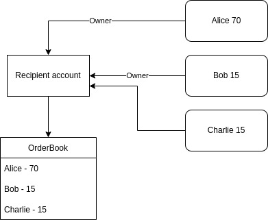
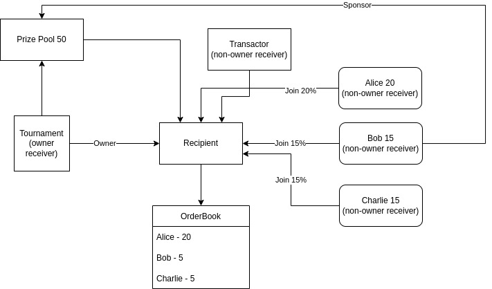

## Payment

For games with all its associated accounts on the chain, the payment can be really complicated.  We introduce a concept of intermediate recipient to simplify this procedure.  An recipient account can be created to receive tokens. It can have one or more wallets behind, each owning a share; we call them receivers.  The newly added receiver must be approved by all the owners.  When assets paid to this receipient account, it will be splited into different orders, and each receiver can claim its own parts.

This model is simple and flexible.  A complex payment can be
restructured in a simple way.  For example, below is a tournament
game, with a crowedfunding prize pool and multiple sponsors. Each
sponsor wants some share from the game commission.

In this structure, the sponsor can contribute the prize pool.  The
contract can manage the payment structure because the tournament is
considered as the owner.
