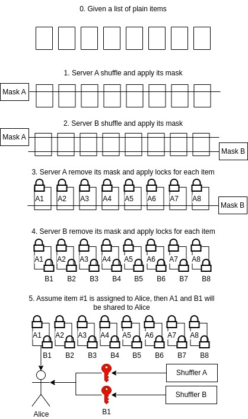

# Randomization

In strategy game, one way the hidden knowledge created is randomization.  For example, in card games, players start with different hands.  In Race the games are served by general servers, and the mental poker algorithm is introduced for randomization.  The ranomization can either be done by players or servers.  Usually players generated randomness represents a better fairness, but it works poorly with bad network connection, which is common in reality.  Servers generated randomization is fast, but servers from different owners are required for fairness.

Some additionaly means can be introduced to increase the fairness, for example, using random generated by servers, but players pick the items by themselves.

## Implementation

The whole progress can be described as below:

Currently, Chacha20 is used as item secrets, and RSA is used for encryption for private communication.
