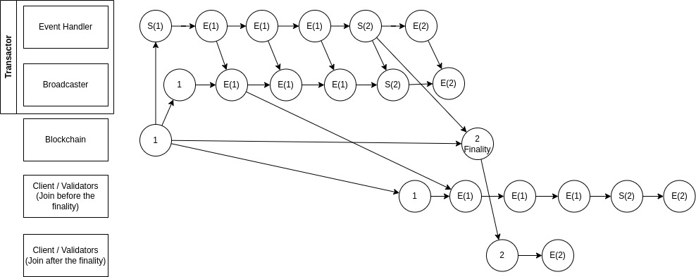

# Synchronization

In theoretically, the game account will be synchronized with the game
progress.  However in real case, transaction finalty takes time,
sometimes could be much longer than expected.  So the data on game
account is usually delayed from the game progress.  To complicate
things further, we need to get players to join the game through the
contract, the new player information is updated in real time.  So the
game account is synchronized with game progress in an bidirected
asynchronized way.

## Access Version

Considering follow case,

Nodes could be either server or client.  We requires all nodes have
the same calculation all the time.  So when node B initializing the
game state, even though player C is already in game, it should be
excluded from the game.  Otherwise, node A and B would have different
states from the calculation.  To solve this, we introduce a version
number: `access_version`. It will be increased by 1 every time a
player or server joined.  And each join takes current version as its
own `access_version`.  When initiating the game state, we use
`access_version` to filter out who is already in game at the time.

## Settle Version

Another version number is called `settle_version`, which indicates how
many times the game has been settled.  Each settlement will result in
an increment.  This number can represent a version of a state of
players' assets. Events and deposits will be tagged with
`settle_version`. So everyone can accumulate current state by
initiating from current on-chain account, `access_version` and
`settle_version`.

This graph illustrated how how game state is sychronized between
on-chain account, transactor and other nodes.

> S(n) means the settle event with settle_version = n.
> E(n) means the normal event with settle_version = n.

We also use settle version to represent a deposit in further.  Usually the player deposit in the middle of the game can't be handled instantly.  So when a deposit transaction is handled, a deposit record will be stored in game account with a `settle_version` which is greater than the account's.  It means this deposit will be collected in future.

