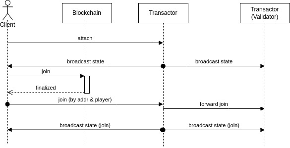
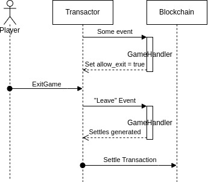

# Transactions

The primary goal of RACE is to build a trustworthy web3 game infrastructure. Thus we use blockchains as the source of the trust.  A general contract works together with general servers to provide the fundamentals for game development.  This article will go through all important transaction instructions in RACE.

## Join Game

A player client can join a game by sending a transaction to RACE contract with their token assets and encryption public keys.  The contract will save such information in the game account that is public. Therefore, everyone in the game will know a new player came and use their public keys to encrypt the private messages.  The transactor server will pick up the new player into the game when it sees the update on chain.

## Settle and Exit Game

The player client doesn't leave the game by sending transaction directly; instead the leaving is handled in a settle transaction sent by the Transactor.  Whenever a game is completed, a settle transaction is prepared.  Depending on the performance of the target blockchain, multiple instructions may be compressed into one to reduce the processing time.  A settle transaction indicates how assets are transferred among players and paid out the assets for leaving players.  The contract only accepts settle transactions sent by Transactor, unless others vote for its inactive.

## Serve

A server can serve a game by talking to the contract to write itself into game account.  The first-to-join server will be considered as Transactor when the game starts.  To serve a game, the server has to stake something; this mechanism can help to get rid of abusing.

## Game Bundle

A game bundle is an address pointing to a WASM package which satisfies the Race protocol.  Bundles can be either served by general servers or executed by clients.  Since every node uses the same bundle for the same game, and all deal with the same event stream (either by encrypted or not), calculation results will be the same for all. Publishing games is done by talking to the contract. An account will be created for the bundle and data will be stored in decentralized storage such as IPFS or Arweave.

## Create Game Account

A game account can be created with some initial properties and an address that refers to a game bundle.  Each game account has some slots for both players and servers to join it. There's usually a minor cost for creating game accounts. Yet as the game owner, you will earn the game commisions as benefits.

## Vote

Vote transactions can be sent by anyone in a game, including the clients and the servers.  The vote is usually used to decide that Transactor is not working.  Once the contract received enough votes, it halts the game and waits for governance interventions.
