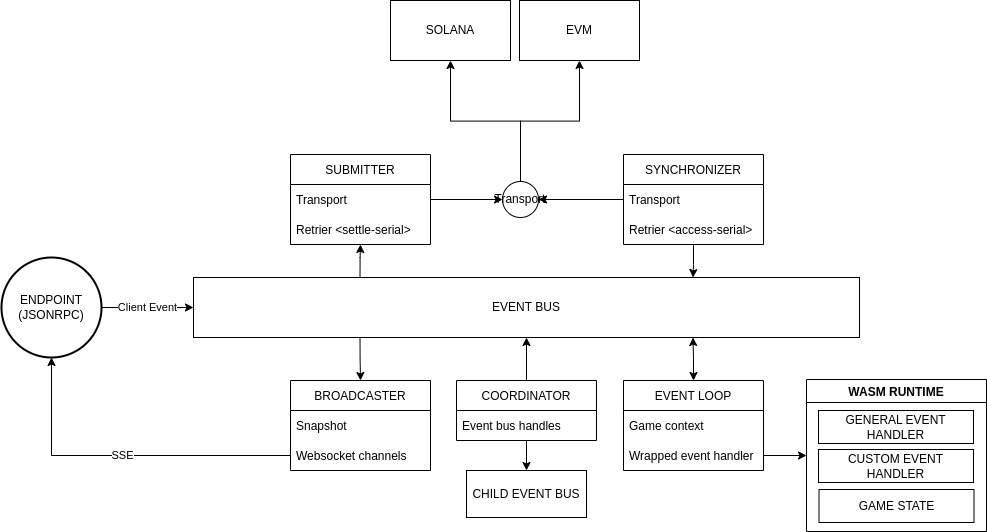
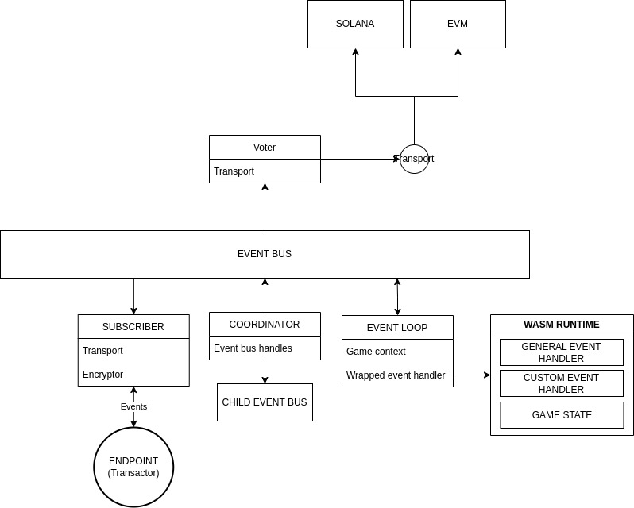

# Transactor and Validator

In race protocol, the game are served by a server cluster.  Each server runs either in Transactor mode or in Validator mode.  Usually, the transactor is the first server to join the server, which acts as a relay for other servers and clients and makes all settlement transactions.  Other servers run in Validator mode, acts as validator and randomization participants.

Here the differences of both modes are listed below.

## Transactor Mode

- Calculating game state
- Making transaction for settlements
- Generating randomness
- Receiving client events
- Broadcasting events

## Validator Mode

- Calculating game state
- Voting inactive of the Transactor
- Generating randomness

