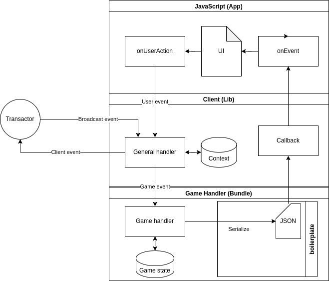
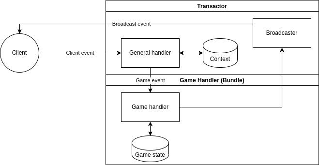

# WebAssembly Usages

## Client Side

In Race, game logic will be written in Rust, can compile as WebAssembly(WASM).  We choose WASM because it's performant, portable and well-adopted.  Modern browsers support WASM by default, the interaction with WASM bundle and transactor are implemented as Race SDK.  To build the frontend, typically you will introduce Race SDK to your project, and tell it which address of game account to load, then it will handle everything.  The game frontend are independent from the game bundle, that means you don't have to write game logic, if the logic implementation exists, you can just use and focus on the UI/UX.

In client side, the runtime can be described as following:

## Server Side

In server side, there are serveral options.  Currently we are use .  Other options may be introduced later.

In client side, the runtime can be described as following:

