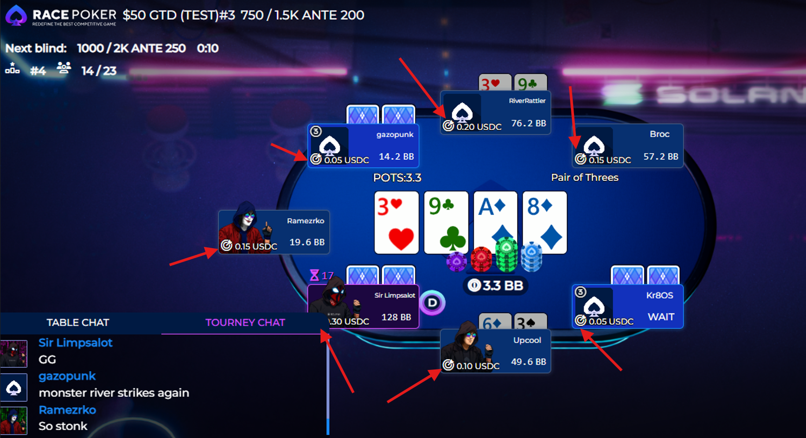

# 🎯 PKO Bounties

Many of our most exciting tournaments are Progressive Knockout (PKO) events. Get ready for a high-action poker experience where you win instant cash bounties for every single player you eliminate!

***

### **The Big Idea: Poker with a Price on Everyone's Head**

Think of a PKO tournament like a video game where every player has a bounty on their head. When you knock a player out, you immediately collect a portion of their bounty as a cash prize. The other portion is added to your own bounty, making you a more valuable target for other players.

The more players you eliminate, the bigger the target on your back becomes!

***

### **How it Works: The 50/50 Split**

The most important concept to understand is how the bounty is split. \
When you buy in the tournament, the bounty portion of the ticket is allocated to the bounties.

<figure><figcaption>
On the screenshot, we see that 20% of the 10 RRR buy-in is reserved for bounties.
</figcaption></figure>

This amount is then divided in half — an instant prize for elimination and progressive knock-out.\

* **💸 50% is available instantly upon player elimination:** This is a real cash prize, sent directly to the one who eliminated the player. It's theirs to keep, no matter where they finish in the tournament.

<figure><figcaption>
In the game interface you see the Instant Payout portion of the bounty next to the profile picture:  The amount you will get instantly for eliminating that player. 
</figcaption></figure>

* **📈 50% is added to the killer's "Head value":** This "progressive" portion is not displayed in the UI and it increases the price on the head for those who eliminate players, making them a juicier target for their opponents.

Let's break down the two types of bounties you'll see in-game:

*   💰 **Your Bounty Winnings (Cash in Your Pocket):** This is the total amount of cash you have already won by knocking out other players. It goes to your wallet and is available instantly.

    
<figure><figcaption></figcaption></figure>

* 🎯 **Your Bounty Value (The Target on Your Back):** This is the prize amount another player will win if they eliminate you. This value grows larger every time you knock someone else out.\
  It is displayed in-game next to your profile picture.

#### Key Takeaway

The bounty amount shown on a player's head is not their earnings. \
It is the prize someone else gets for eliminating them.\

***

### **Let's See it in Action: A PKO Example**

Imagine a tournament where part of your buy-in gives every player a **starting bounty of $2**.

**The Setup:**

* After the 50/50 split — You have a **$1 bounty** on your head available instantly.
* Player B also has a **$1 bounty** on their head.

**The Knockout:**\
You go all-in against Player B and win the hand, eliminating them from the tournament.

**The Payout (The Magic!):**\
Here’s what happens instantly to Player B's **$2** bounty:

* **💸 You get $1 in cash!** (to your wallet, instantly) as your Bounty Winnings.
* **📈 Your own bounty value increases by $1!** (the other 50%).

**The New Scoreboard:**

* **Your Bounty Winnings:** You have now earned **$1**.
* **Your New Bounty Value:** Your own starting bounty was $**1**. You just added $**1** to it. The bounty on your head is now $**2**.

**Let's Keep it Going...**

Now, you eliminate another player who also had a **$1 starting bounty**.

* **💸 You get another $1 in cash!** Your total cash winnings are now **$1** + **$1** = **$2**
* **📈 Your bounty value increases by another $1!** Your own bounty is now **$2** + **$1** = **$3**.

The next person who knocks you out will get a bigger prize, because you're a bigger threat!


If you eliminate a player with a higher instant payout part - displayed next to the player's head - you will receive that amount instantly, however your own "value" will only grow by the 50% of the initial bounty part.\
\
Let's say Player D has eliminated few players already, so his "head value" is $5.\
If you eliminate Player D, you will receive $5 instantly, while your value will grow by $1.


***

### **Why PKO Tournaments Are So Exciting**

* **💰 You Can Profit Without Reaching the Final Table:** You can be eliminated before the official prize money starts and still walk away with a profit just from the bounties you've collected.
* **💥 PKOs Reward Aggressive Play:** Every all-in confrontation is more intense when there's an instant cash bounty on the line. It encourages action and creates thrilling moments.
* **🎯 The Target Grows:** As players accumulate knockouts, their bounties can become huge. A late-game pot can be worth a massive prize, not just in chips, but in real money from a single elimination.
